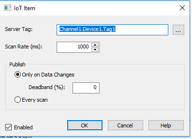

# Azure IoT Edge - How to connect PTC's Kepware KepServerEx

These instructions provide the necessary steps to connect PTC's Kepware KepServerEx to Azure IoT Hub **through** Azure IoT Edge.

## Overview

PTC's Kepware KepServerEx (KepServerEx) is an industry leader in industrial and manufacturing device connectivity. It has connectivity libraries for a vast array of equipment and is a popular choice for unlocking the data from both new and legacy industrial devices. Kepware provides an IoT Gateway module today that, per their own [instructions](https://www.kepware.com/getattachment/c93c65df-57ea-4e9c-a1e0-2e9a34381d54/mqtt-client-and-microsoft-azure-iot.pdf), can be used to connect to and send data to Azure IoT Hub over the MQTT protocol.  

Many customers have expressed a desire to be able to send the data from Kepware KepServerEx through Azure IoT Edge. That allows both for Edge to act as a gatewey through which traffic must flow, thus isolating the Kepware KepServerEx further from the Internet, as well as the ability to take advantage of the many IoT Edge capabilties for pre-processing that data on the Edge. Examples include the ability to do custom modules or Azure Functions to transform the data, Azure Streaming Analytics to do filtering and aggregation of the data before it goes to the cloud, and Azure Machine Learning for making predictions on the Edge, potentially without having to send all of the detailed data to the cloud.

Below are the step-by-step instructions for connecting Kepware to IoT Hub through IoT Edge

## Prerequisites

You will need

* an IoT Hub.  If you do not already have one, create one via the instructions [here](https://docs.microsoft.com/en-us/azure/iot-hub/iot-hub-create-using-cli#create-an-iot-hub)
* an Azure IoT Edge device set up as a 'transparent gateway' per the Azure IoT Edge documentation ([linux](https://docs.microsoft.com/en-us/azure/iot-edge/how-to-create-transparent-gateway-linux) or [windows](https://docs.microsoft.com/en-us/azure/iot-edge/how-to-create-transparent-gateway-windows)).  Ensure that IoT Edge is set up correctly for secure MQTT communication by running the following command (if Windows, you may have to install openssl)

```bash
openssl s_client -connect [your gateway name]:8883
```

where [your gateway name] is the name you used in the hostname field of your config.yaml file.  If the bottom of the results shows anything other than Verified (ok), then you'll need to fix that before moving on

* a Kepware KepServerEx set up and licensed for Kepware's IoT Gateway plug-in
* Administrative permissions on the Kepware KepServerEx (both KepServerEx and the underlying host machine)

## Environment Setup

Before configuring Kepware, we need to take a few environment steps.  

### Certificates

When Kepware connects to IoT Edge, it will do so with MQTT over TLS.  The Edge Hub module will provide it with a server certificate for the TLS connection and the Kepware KepServerEx must trust that certificate.

* if you used a production certificate from a company like Baltimore, DigiCert, etc to set up your IoT Edge device, or a corporate certificate based on a Certificate Authority(CA) that your Kepware KepServerEx will trust, you can skip this step
  * if you used the dev/test-only [convenience scripts] provided by the IoT product group, you need to copy the Root CA certificate from your IoT Edge box.  You need to get this certificate to a location from which your Kepware KepServerEx can read (either copy local to the Kepware KepServerEx or a file share it can reach)  
    * If you used the instructions above, this certificate will be located at $CERTDIR/certs/azure-iot-test-only.root.ca.cert.pem  (where $CERTDIR is the directory in which you created your dev/test certificates).  
  * on the Kepware KepServerEx, using the Certificate Manager MMC console, import the IoT Edge Root CA certificate into your "Trust Root Certification Authorities" store.  Make sure you do this for the 'machine', and not 'personal'.

### Name resolution

The Kepware KepServerEx must also be able to resolve the fully-qualified domain name of the IoT Edge gateway to its IP address.

* if you have DNS infrastructure services available in the environment in which your Kepware KepServerEx runs, add a DNS entry for your IoT Edge gateway
* if you do not, or just want to test before you do, you can add a hosts file entry on your Kepware KepServerEx for your IoT Edge gateway in the c:\windows\system32\drivers\etc\hosts file

Either way, ensure your Kepware KepServerEx can 'ping' your IoT Edge gateway device by name

### Register Kepware with IoT Hub

Even through Kepware will be physically connecting to IoT Hub via the IoT Edge gateway, it will still authenticate through to IoT Hub.  In order to do so, IoT Hub needs to know about the Kepware KepServerEx.  To do this, we create an IoT Device in IoT Hub to represent our Kepware KepServerEx.

To do this, 

* Open the [Azure Portal](http://portal.azure.com) in your browser
* click on the "Cloud Shell" button on the menu bar across the top


* install the azure iot cli extension with the following command

```bash
az extension add --name azure-cli-iot-ext
```
 * once installed, create your IoT Device to represent your Kepware KepServerEx

 ```bash
 az iot hub device-identity create --device-id [device id] --hub-name [hub name]
 ```
where [device id] is the name you want to use for your IoT Edge (e.g. iotKepware01) and the [hub name] is the short-name of your IoT Hub (e.g. sdbedgeIoTHub)

* Finally, we need to generate a security token (called a "SAS token") for our device.  This will be used as the "password" for the Kepware KepServerEx to connect.  To create the SAS token, run

```bash
az iot hub generate-sas-token --device-id [device id] --hub-name [hub name] --duraction [duration in seconds]
```

where,[device id] is the name of the device you just created, [hub name] is the short-name of your IoT Hub, and [duration in seconds] is the duration, in seconds, that you want your SAS Token to be valid.  Microsoft recommends, for security purposes, periodically 'rolling' the SAS token by generating a new one and updating your Kepware KepServerEx on a schedule you feel balances security with administrative overhead.  Either way, make note of the duration, as you'll need to update the SAS token before the expiration or your Kepware KepServerEx will no longer be ablet to authenticate to IoT Edge.

A valid SAS token will look similar to the following (with [device id] and [hub name] filled in with your values):

SharedAccessSignature sr=[hub name].azure-devices.net%2Fdevices%2F[device id]&sig=zxiTWD2bGOk0ea66FXwFaNO7cboAQSM3OM3u2UNW5T4%3D&se=1567020425

* Copy your generated SAS Token somewhere from which you can paste it later into your Kepware KepServerEx's configuration.  

> NOTE:  in the Kepware instructions for connecting directly to IoT Hub, you may note that there is an option for authenticating to IoT Hub via a self-signed certificate. Today, for IoT Edge, SAS Token authentication is the only option. That may change in the future.

## Kepware Configuration

With the preliminary work done, we are ready to configuration our Kepware KepServerEx.  

* In the KepServerEx Configuration Tool, expand the tree view on the left
* right-click on IoT Gateway and choose "Add Agent".  This opens a wizard for creating a new IoT Gateway Agent

* on the "New Agent" screen
  * give the agent a meaningful name of your choosing
  * choose "MQTT Client" for the type
  * click Next

* On the "MQTT Client - Broker" screen, 
  * enter the following values
    * URL:   ssl://[iot edge device FQDN]:8883
    * Topic:  devices/[device id]/messages/events/
  * note that the url protocol was changed from tcp:// to ssl:// the [iot edge device fqdn] is the hostname of your IoT Edge device.  The [device id] is the device id you created above to represent your KepServerEx server in IoT Hub.  On the topic, **please note the trailing slash and include it**
  * leave the remaining defaults and click Next

* On the MQTT Client - Security screen
  * enter the following values
    * Client ID:   [device id]
    * Username:  [iothub long name]/[device id]/api-version=2016-11-14
    * Password:  [SAS Token]
  * the [iothub long name] is the full name of your IoTHub, including the .azure-devices.net part.  The [SAS Token] is the SAS Token generated and copied above..  Copy/Paste it in here.
  * click "Finish"

Below are a couple of screenshots for comparison. To compare, right click on the Agent in the tree view and choose "Properties.."

For comparison below, the following values were used above:

* [iot edge device FQDN] - iotedgegw.local
* [device id] - iotKepware1
* [iothub long name] - sdbedgeIoTHub.azure-devices.net

Client Tab:


Security Tab:


## Choose tag(s) to send

At this point, you've created an IoT Agent, but it is not yet set to send any data to IoT Edge.  If you click on your newly created agent in the left hand tree view, in the right hand view, you'll see "add IoT item..".  click on that, then navigate to the tag(s) that you want to send to IoT Hub and add them.  For example, the following screenshots show setting up the "Channel1.Device1.Tag1" sample tag that comes with the KepServerEx simulator.




## Validation

Now that we are set up, let's validate everything is working.

* On the KepServerEx Configuration Tool, in the eventlog at the bottom, you should see a successful connection to your Edge Device similar to this


* On the IoT Edge device, in the Edge Hub logs you should see a successful connection from the IoT Device that represents your KepServerEx server.

To view the logs, run this command.

```bash
iotedge logs -f edgeHub
```

You should find a section similar to this (but with your [device id])


* Finally, you should be able to see the data flowing into IoT Hub.  To do, so back in the browser, in the Cloud CLI window, run the following command  (filling in your iot hub name)

az iot hub monitor-events -n [iot hub name]

After a few seconds, you should see messages similar to the below start flowing in


## Next Steps

Congratulations!  You've connected your Kepware KepServerEx server through IoT Edge up to IoT Hub.  Now you can start adding in the additional capabilities of IoT Edge to process the data on the Edge...  

This is where your imagination can take over, but a few ideas from other customers

* custom IoT Edge modules to reformat or otherwise manipulate the messages from devices.  Or potentially to push the data to a local dashboard or 3rd party historian.
* Azure Streaming Analytics on Edge jobs to
  * filter out data you may not want to send to the cloud
  * aggregate data on the edge.  If data is coming from machine at a higher rate than you want, you can use ASA on the Edge to do time based aggregations of that data
* Azure Machine Learning modules to do real-time predition of machine failures or anomaly detection.  

